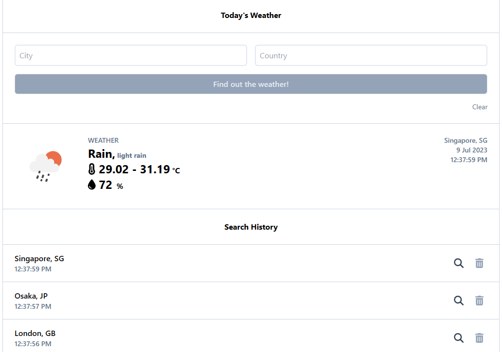
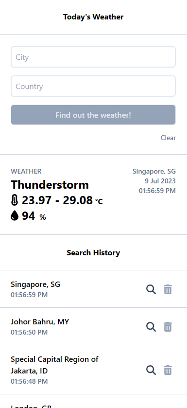

# Weather React App

## Development requirements

This application is developed base on the requirements below:


## Setup

Before building and running the react app, add the environment variables:

```
REACT_APP_OPEN_WEATHER_API_KEY=9718c90bb6647d81eeaf5db9e44a0af0
REACT_APP_ENVIRONMENT=production
```

You may use the API key specified above

## Assumptions

I made a few assumptions on the behaviour of the UI shown in the requirements above:

1. Search histories are based on cities. Searching a city that has been searched before will automatically push that city to the top of the search history list. No two cities can exist at the same time in the search history
2. Maximum search entries in history is 10
3. Forms are cleared after submitting
4. Data shown is in metric units
5. If there is no search history, the search history component does not render

## Code structure

```python
- src
  - api
    - handler.ts # Handles to handle AJAX request and responses
    - ... # Functions to call different api services
  - components
    - ... # Reusable UI components
  - hooks
    - ... # Hooks for handling anything none-UI related, to relieve code clutter in UI code
  - store
    - index.ts # Redux configuration
    - storeType
      - reducer.ts # Redux reducers
      - hooks.ts # Hooks to make use of the store and reducers
  - utils
  - views # Page components
  App.tsx
  Providers.tsx # Application level settings
```

## Libraries used

### Main dependencies

1. Typescript of styling
2. Redux Toolkit for state management and state persistence
3. React Hook Form for form state management
4. Lodash for some basic lang utils
5. DayJS for time formatting
6. Axios for AJAX
7. FontAwesome for icons used

### Dev dependencies

1. Airbnb eslint styles
2. Prettier for formatting code

## Some screenshots

### Main screen




### Error message


### Loading state


### Mobile screen


